# Live Feedback Wall (LFW)

## Dokumentacja projektowa

---

**Nazwa projektu:** Live Feedback Wall (LFW)

**Autor:** Błażej Kowalczyk [BK]

**Uczelnia:** Uniwersytet Śląski w Katowicach

**Wydział:** Wydział Nauk Ścisłych i Technicznych

**Kierunek:** Informatyka

**Przedmiot:** Projekt Systemu

**Prowadząca:** dr Magdalena Tkacz

**Rok akademicki:** 2025/2026

**Repozytorium:** [https://github.com/bsk03/live-feedback-wall](https://github.com/bsk03/live-feedback-wall)

**Aplikacja live:** [https://live-feedback-wall.onrender.com](https://live-feedback-wall.onrender.com)

---

\newpage

## Spis treści

1. [Słownik](#2-słownik)
2. [Cel, zakres projektu, odbiorca](#3-cel-zakres-projektu-odbiorca)
3. [Architektura](#4-architektura)
4. [Wymagania](#5-wymagania)
5. [Ograniczenia](#6-ograniczenia)
6. [Użytkownicy](#7-użytkownicy)
7. [Przypadki użycia](#8-przypadki-użycia)
8. [Baza danych](#9-baza-danych)
9. [Diagramy sekwencji](#10-diagramy-sekwencji)
10. [Diagramy aktywności](#11-diagramy-aktywności)
11. [Diagramy stanów](#12-diagramy-stanów)
12. [Dokumentacja bezpieczeństwa](#13-dokumentacja-bezpieczeństwa)
13. [Dostępność (WCAG)](#14-dostępność-wcag)
14. [Diagram klas](#15-diagram-klas)
15. [Kod SQL](#16-kod-sql)
16. [Przypadki testowe](#17-przypadki-testowe)
17. [Testy jednostkowe](#18-testy-jednostkowe)
18. [Diagram komponentów i wdrożenia](#19-diagram-komponentów-i-wdrożenia)
19. [Instalacja i konfiguracja (CI/CD)](#20-instalacja-i-konfiguracja-cicd)
20. [Implementacja mechanizmów bezpieczeństwa](#21-implementacja-mechanizmów-bezpieczeństwa)
21. [Podręcznik użytkownika](#22-podręcznik-użytkownika)

\newpage

## 1. Słownik

| Pojęcie                     | Definicja                                                                                                                                           |
| --------------------------- | --------------------------------------------------------------------------------------------------------------------------------------------------- |
| **Pokój (Room)**            | Wirtualna przestrzeń utworzona przez organizatora, do której uczestnicy mogą dołączać i wysyłać wiadomości w czasie rzeczywistym.                   |
| **Kod pokoju**              | Unikalny 7-znakowy identyfikator w formacie `XXX-XXX` (litery i cyfry), służący do dołączania do pokoju.                                            |
| **Organizator**             | Zarejestrowany użytkownik, który tworzy pokoje, udostępnia kody dostępu i moderuje wiadomości.                                                      |
| **Uczestnik**               | Anonimowy użytkownik, który dołącza do pokoju za pomocą kodu i wysyła wiadomości. Nie wymaga rejestracji.                                           |
| **Feedback Wall**           | Interaktywna ściana komentarzy wyświetlająca wiadomości uczestników w czasie rzeczywistym.                                                          |
| **WebSocket**               | Protokół komunikacji dwukierunkowej między przeglądarką a serwerem, umożliwiający przesyłanie danych w czasie rzeczywistym bez odpytywania serwera. |
| **Socket.IO**               | Biblioteka JavaScript implementująca komunikację WebSocket z mechanizmami automatycznego ponownego łączenia i fallbackiem na HTTP long-polling.     |
| **Sesja**                   | Obiekt przechowywany po stronie serwera, zawierający dane uwierzytelnienia użytkownika (token, czas wygaśnięcia, adres IP).                         |
| **Soft delete**             | Technika usuwania danych polegająca na oznaczeniu rekordu jako usuniętego (flaga `deleted`) bez fizycznego usunięcia z bazy danych.                 |
| **OTP (One-Time Password)** | W kontekście projektu: 6-znakowy kod alfanumeryczny wprowadzany przez uczestnika w celu dołączenia do pokoju.                                       |
| **tRPC**                    | Biblioteka do tworzenia typowo-bezpiecznych API w TypeScript, eliminująca potrzebę generowania klientów API.                                        |
| **Drizzle ORM**             | Lekki ORM (Object-Relational Mapping) dla TypeScript, służący do definiowania schematu bazy danych i wykonywania zapytań.                           |
| **QR Code**                 | Dwuwymiarowy kod kreskowy generowany dla każdego pokoju, umożliwiający szybkie dołączenie przez zeskanowanie aparatem.                              |
| **Rate limiting**           | Mechanizm ograniczający liczbę żądań (wiadomości) wysyłanych przez użytkownika w określonym przedziale czasu.                                       |
| **Infinite scroll**         | Wzorzec interfejsu użytkownika, w którym kolejne dane (wiadomości) ładowane są automatycznie przy przewijaniu.                                      |

\newpage

## 2. Cel, zakres projektu, odbiorca

### Cel projektu

Celem projektu jest stworzenie aplikacji webowej umożliwiającej zbieranie opinii i komentarzy od uczestników wydarzeń (prezentacji, warsztatów, wykładów, spotkań) w czasie rzeczywistym. Aplikacja ma zastąpić tradycyjne metody zbierania feedbacku (kartki, formularze po wydarzeniu) interaktywną, natychmiastową formą komunikacji.

### Zakres projektu

Projekt obejmuje:

- System rejestracji i logowania organizatorów (email + hasło)
- Panel organizatora do tworzenia i zarządzania pokojami
- Generowanie unikalnych kodów dostępu i kodów QR do pokoi
- Widok uczestnika z możliwością dołączenia przez kod i wysyłania wiadomości
- Komunikację w czasie rzeczywistym (WebSocket)
- Moderację wiadomości (soft delete)
- Paginację wiadomości (infinite scroll)
- Responsywny interfejs (mobile + desktop) z trybem ciemnym/jasnym
- Mechanizmy bezpieczeństwa (rate limiting, walidacja, security headers)
- Podstawową zgodność z WCAG 2.1

### Odbiorca docelowy

- **Prowadzący prezentacje i wykłady** - zbieranie pytań i opinii od publiczności
- **Moderatorzy warsztatów** - interakcja z uczestnikami w czasie rzeczywistym
- **Organizatorzy spotkań firmowych** - anonimowe zbieranie feedbacku od pracowników
- **Wykładowcy akademiccy** - angażowanie studentów podczas zajęć

### Linki

- **Repozytorium:** [https://github.com/bsk03/live-feedback-wall](https://github.com/bsk03/live-feedback-wall)
- **Aplikacja live:** [https://live-feedback-wall.onrender.com/](https://live-feedback-wall.onrender.com/)

\newpage

## 3. Architektura

### Model architektoniczny

Aplikacja oparta jest na architekturze **klient-serwer** z komunikacją w czasie rzeczywistym. Wykorzystuje wzorzec **T3 Stack** (Next.js + tRPC + Drizzle + Tailwind) rozszerzony o warstwę WebSocket (Socket.IO).

### Warstwy systemu

| Warstwa                | Technologia                        | Odpowiedzialność                               |
| ---------------------- | ---------------------------------- | ---------------------------------------------- |
| Prezentacji (Frontend) | Next.js 15, React 18, Tailwind CSS | Interfejs użytkownika, routing, stan aplikacji |
| API (Backend)          | tRPC, Next.js API Routes           | Logika biznesowa, walidacja, autentykacja      |
| Komunikacji real-time  | Socket.IO                          | Dwukierunkowa komunikacja WebSocket            |
| Danych                 | PostgreSQL, Drizzle ORM            | Przechowywanie i zarządzanie danymi            |
| Autentykacji           | Better Auth                        | Zarządzanie sesjami, hashowanie haseł          |

### Diagram architektury

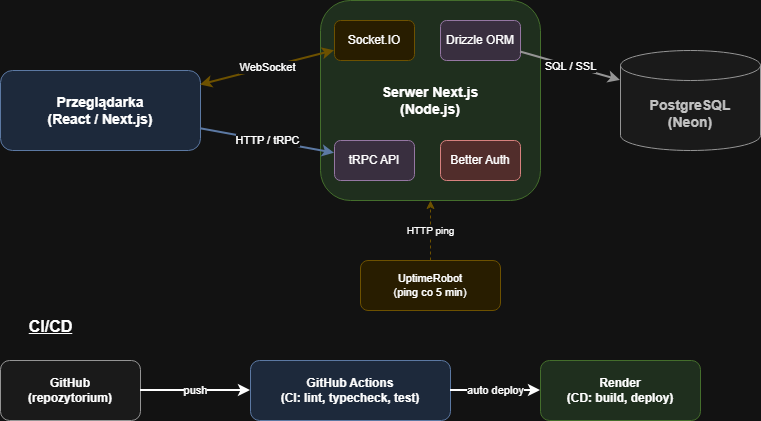

**Opis:** Diagram przedstawiający warstwy systemu i przepływ danych. Przeglądarka komunikuje się z serwerem Next.js poprzez HTTP (tRPC) dla operacji CRUD oraz przez WebSocket (Socket.IO) dla komunikacji real-time. Serwer łączy się z bazą PostgreSQL (Neon) przez Drizzle ORM. CI/CD realizowane przez GitHub Actions i Render.

\newpage

## 4. Wymagania

### a) Wymagania funkcjonalne

| ID    | Wymaganie                                                                     | Priorytet |
| ----- | ----------------------------------------------------------------------------- | --------- |
| WF-01 | System umożliwia rejestrację organizatora za pomocą adresu email i hasła      | Wysoki    |
| WF-02 | System umożliwia logowanie organizatora za pomocą adresu email i hasła        | Wysoki    |
| WF-03 | System umożliwia wylogowanie organizatora                                     | Wysoki    |
| WF-04 | Organizator może utworzyć nowy pokój z podaną nazwą                           | Wysoki    |
| WF-05 | System automatycznie generuje unikalny kod pokoju w formacie XXX-XXX          | Wysoki    |
| WF-06 | Organizator może przeglądać listę swoich pokoi                                | Wysoki    |
| WF-07 | Organizator może udostępnić kod pokoju oraz kod QR                            | Średni    |
| WF-08 | Uczestnik może dołączyć do pokoju za pomocą 6-znakowego kodu                  | Wysoki    |
| WF-09 | Uczestnik może wysyłać wiadomości tekstowe do pokoju                          | Wysoki    |
| WF-10 | Wiadomości wyświetlane są wszystkim użytkownikom pokoju w czasie rzeczywistym | Wysoki    |
| WF-11 | Organizator może przeglądać wiadomości w panelu administracyjnym              | Wysoki    |
| WF-12 | System obsługuje paginację wiadomości (infinite scroll)                       | Średni    |
| WF-13 | Użytkownik może przełączać motyw (ciemny/jasny)                               | Niski     |

### b) Wymagania niefunkcjonalne

| ID    | Wymaganie                                                                | Kategoria      |
| ----- | ------------------------------------------------------------------------ | -------------- |
| WN-01 | Czas dostarczenia wiadomości do pozostałych uczestników < 500ms          | Wydajność      |
| WN-02 | Interfejs dostosowuje się do urządzeń mobilnych i desktopowych           | Użyteczność    |
| WN-03 | Komunikacja odbywa się przez protokół HTTPS/WSS                          | Bezpieczeństwo |
| WN-04 | Hasła użytkowników są hashowane przed zapisem w bazie                    | Bezpieczeństwo |
| WN-05 | System ogranicza liczbę wiadomości do 30 na minutę per użytkownik        | Bezpieczeństwo |
| WN-06 | Aplikacja obsługuje nagłówki bezpieczeństwa (HSTS, X-Frame-Options, CSP) | Bezpieczeństwo |
| WN-07 | Walidacja danych wejściowych po stronie klienta i serwera (Zod)          | Bezpieczeństwo |
| WN-08 | System spełnia podstawowe wymagania WCAG 2.1 poziom AA                   | Dostępność     |
| WN-09 | Aplikacja dostępna 24/7 (hosting Render + UptimeRobot)                   | Dostępność     |
| WN-10 | System obsługuje język polski w interfejsie i komunikatach błędów        | Użyteczność    |

\newpage

## 5. Ograniczenia

### Ograniczenia sprzętowe

| Element                | Wymaganie minimalne                                                        |
| ---------------------- | -------------------------------------------------------------------------- |
| Urządzenie użytkownika | Dowolne urządzenie z przeglądarką internetową (komputer, tablet, smartfon) |
| Przeglądarka           | Chrome 90+, Firefox 90+, Safari 14+, Edge 90+                              |
| Połączenie internetowe | Wymagane (WebSocket wymaga stałego połączenia)                             |
| Serwer (development)   | Node.js 20+, 512 MB RAM                                                    |
| Serwer (produkcja)     | Render Free Tier (512 MB RAM, shared CPU)                                  |

### Ograniczenia programowe

| Element                   | Szczegóły                                         |
| ------------------------- | ------------------------------------------------- |
| Środowisko uruchomieniowe | Node.js >= 20.0.0                                 |
| Baza danych               | PostgreSQL 14+                                    |
| System operacyjny serwera | Linux (Render), Windows/macOS/Linux (development) |
| Menedżer pakietów         | npm                                               |

### Ograniczenia projektowe

- Darmowy hosting Render — aplikacja może zostać uśpiona po 15 minutach nieaktywności (rozwiązanie: UptimeRobot)
- Darmowy tier Neon PostgreSQL — limit 0.5 GB storage
- Brak możliwości horyzontalnego skalowania Socket.IO bez Redis Adapter

\newpage

## 6. Użytkownicy (aktorzy / role / persony)

### Aktorzy systemowi

| Aktor           | Opis                                                                                                             | Autentykacja                   |
| --------------- | ---------------------------------------------------------------------------------------------------------------- | ------------------------------ |
| **Organizator** | Zarejestrowany użytkownik, który tworzy pokoje, udostępnia kody dostępu, przegląda wiadomości i moderuje treści. | Wymagana (email + hasło)       |
| **Uczestnik**   | Anonimowy użytkownik, który dołącza do pokoju za pomocą kodu i wysyła wiadomości.                                | Brak (dostęp przez kod pokoju) |

### Persony

#### Persona 1: Organizator

| Cecha                 | Opis                                                                                                                                                                                                            |
| --------------------- | --------------------------------------------------------------------------------------------------------------------------------------------------------------------------------------------------------------- |
| **Imię**              | Anna Nowak                                                                                                                                                                                                      |
| **Wiek**              | 34 lata                                                                                                                                                                                                         |
| **Rola**              | Trenerka prowadząca warsztaty UX Design                                                                                                                                                                         |
| **Cel**               | Chce zbierać na żywo opinie od 20-30 uczestników warsztatów, żeby dynamicznie dostosowywać tempo i treść zajęć.                                                                                                 |
| **Frustracje**        | Dotychczas używała karteczek samoprzylepnych — trudno je odczytać, łatwo zgubić, brak archiwizacji. Formularze online (Google Forms) wypełniane są po zajęciach, kiedy uczestnicy już nie pamiętają szczegółów. |
| **Scenariusz użycia** | Przed warsztatem Anna tworzy pokój w Live Feedback Wall, wyświetla QR code na projektorze. Uczestnicy skanują kod telefonem i wysyłają komentarze. Anna widzi je na panelu w czasie rzeczywistym.               |

#### Persona 2: Uczestnik

| Cecha                 | Opis                                                                                                                                                           |
| --------------------- | -------------------------------------------------------------------------------------------------------------------------------------------------------------- |
| **Imię**              | Tomek Wiśniewski                                                                                                                                               |
| **Wiek**              | 22 lata                                                                                                                                                        |
| **Rola**              | Student informatyki na wykładzie                                                                                                                               |
| **Cel**               | Chce szybko zadać pytanie prowadzącemu bez przerywania wykładu i bez konieczności rejestracji.                                                                 |
| **Frustracje**        | Wstydzi się zadawać pytania na głos. Nie chce zakładać kolejnego konta w nowym serwisie.                                                                       |
| **Scenariusz użycia** | Tomek skanuje QR code wyświetlony na slajdzie, wpisuje 6-znakowy kod, pisze pytanie. Prowadzący widzi je na swoim panelu i odpowiada na nie w trakcie wykładu. |

\newpage

## 7. Przypadki użycia

### Lista przypadków użycia

| ID    | Przypadek użycia                   | Aktor                  |
| ----- | ---------------------------------- | ---------------------- |
| PU-01 | Rejestracja organizatora           | Organizator            |
| PU-02 | Logowanie organizatora             | Organizator            |
| PU-03 | Wylogowanie organizatora           | Organizator            |
| PU-04 | Tworzenie pokoju                   | Organizator            |
| PU-05 | Przeglądanie listy pokoi           | Organizator            |
| PU-06 | Udostępnianie kodu pokoju / QR     | Organizator            |
| PU-07 | Podgląd wiadomości w panelu        | Organizator            |
| PU-08 | Dołączanie do pokoju przez kod     | Uczestnik              |
| PU-09 | Wysyłanie wiadomości               | Uczestnik              |
| PU-10 | Przełączanie motywu (ciemny/jasny) | Organizator, Uczestnik |

### a) Diagram przypadków użycia

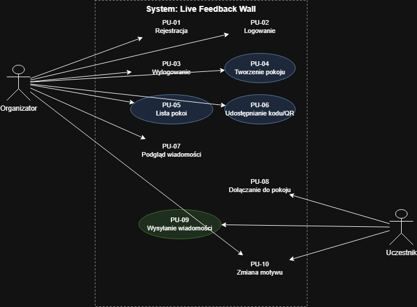

**Opis:** Diagram UML przedstawiający dwóch aktorów (Organizator, Uczestnik) oraz ich przypadki użycia. Organizator ma dostęp do PU-01 - PU-07 i PU-10. Uczestnik ma dostęp do PU-08 - PU-10.

### b) Scenariusz przypadku użycia [BK]

**PU-08: Dołączanie do pokoju przez kod**

| Element             | Opis                                                                                                                                 |
| ------------------- | ------------------------------------------------------------------------------------------------------------------------------------ |
| **Aktor główny**    | Uczestnik                                                                                                                            |
| **Cel**             | Dołączenie do istniejącego pokoju feedback wall                                                                                      |
| **Warunki wstępne** | Uczestnik posiada 6-znakowy kod pokoju (otrzymany od organizatora lub zeskanowany z QR). Pokój o podanym kodzie istnieje w systemie. |
| **Warunki końcowe** | Uczestnik znajduje się w pokoju i może wysyłać wiadomości.                                                                           |

**Scenariusz główny:**

1. Uczestnik otwiera stronę dołączania do pokoju (`/rooms/join`).
2. System wyświetla formularz z 6 polami na znaki kodu.
3. Uczestnik wpisuje 6-znakowy kod pokoju.
4. Uczestnik klika przycisk "Dalej".
5. System waliduje kod (format XXX-XXX).
6. System wyszukuje pokój w bazie danych.
7. System zapisuje dane pokoju w localStorage przeglądarki.
8. System przekierowuje uczestnika do widoku pokoju (`/rooms/[id]`).
9. System nawiązuje połączenie WebSocket i dołącza do pokoju.
10. Uczestnik widzi historię wiadomości i może wysyłać nowe.

**Scenariusz alternatywny:**

- 5a. Kod ma nieprawidłowy format - przycisk "Dalej" jest nieaktywny.
- 6a. Pokój o podanym kodzie nie istnieje - system wyświetla komunikat "Błąd podczas dołączania do pokoju".

\newpage

## 8. Baza danych

### a) Model koncepcyjny

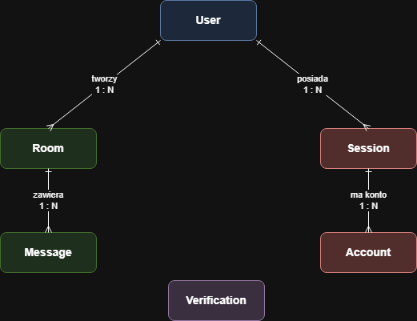

**Opis:** Diagram przedstawiający encje i relacje bez atrybutów. Encje: User, Room, Message, Session, Account, Verification. Relacje: User 1:N Room, Room 1:N Message, User 1:N Session, User 1:N Account.

### b) Model logiczny

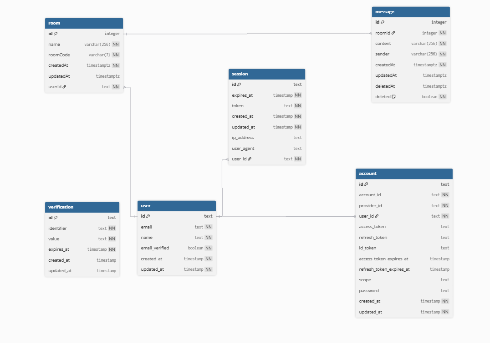

**Opis:** Diagram ERD z atrybutami i typami danych. Każda encja jako prostokąt z listą kolumn (nazwa, typ, PK/FK/NOT NULL). Relacje oznaczone liniami z krotnościami.

### c) Model fizyczny

Model fizyczny bazy danych zaimplementowany jest w dialekcie PostgreSQL. Pełny kod SQL znajduje się w repozytorium:

- **Standard SQL (ANSI):** [`sql/standard.sql`](../sql/standard.sql)
- **Dialekt PostgreSQL:** [`sql/postgresql.sql`](../sql/postgresql.sql)

Schemat bazy definiowany jest w kodzie za pomocą Drizzle ORM:

- [`src/server/db/schema/auth-schema.ts`](../src/server/db/schema/auth-schema.ts) - tabele autentykacji (user, session, account, verification)
- [`src/server/db/schema/room.ts`](../src/server/db/schema/room.ts) - tabela pokoi
- [`src/server/db/schema/message.ts`](../src/server/db/schema/message.ts) - tabela wiadomości

Migracje generowane automatycznie przez Drizzle Kit znajdują się w katalogu `drizzle/`.

\newpage

## 9. Diagramy sekwencji

### Lista diagramów sekwencji

| ID    | Diagram                        | Opis                                                                      |
| ----- | ------------------------------ | ------------------------------------------------------------------------- |
| DS-01 | Rejestracja organizatora       | Przepływ: formularz → sprawdzenie email → utworzenie konta → sesja        |
| DS-02 | Logowanie organizatora         | Przepływ: formularz → walidacja hasła → utworzenie sesji → przekierowanie |
| DS-03 | Tworzenie pokoju               | Przepływ: formularz → generowanie kodu → zapis w DB → odświeżenie listy   |
| DS-04 | Dołączanie do pokoju           | Przepływ: kod OTP → walidacja → zapis w localStorage → WebSocket join     |
| DS-05 | Wysyłanie wiadomości real-time | Przepływ: input → tRPC mutation → DB insert → Socket.IO emit → broadcast  |

### Diagram sekwencji: Wysyłanie wiadomości w czasie rzeczywistym (DS-05) [BK]

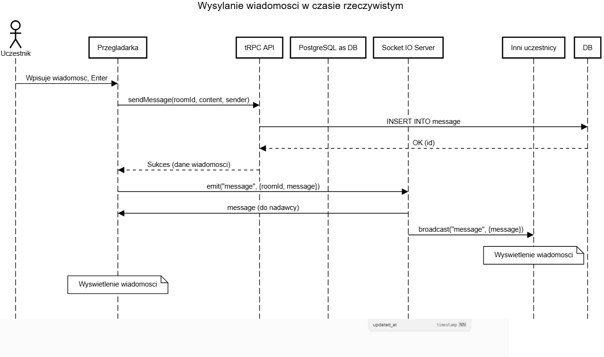

**Opis:** Diagram przedstawiający przepływ wysyłania wiadomości od momentu wpisania tekstu przez uczestnika do wyświetlenia u wszystkich użytkowników pokoju.

_Przepływ:_

1. _Uczestnik → Przeglądarka: wpisuje wiadomość i naciska Enter_
2. _Przeglądarka → tRPC API: `message.sendMessage({ roomId, content, sender })`_
3. _tRPC API → Baza danych: `INSERT INTO message (...)`_
4. _Baza danych → tRPC API: potwierdzenie zapisu (zwraca id)_
5. _tRPC API → Przeglądarka: sukces (dane wiadomości)_
6. _Przeglądarka → Socket.IO Server: `emit("message", { roomId, message })`_
7. _Socket.IO Server → Inni uczestnicy: `broadcast("message", { message })`_
8. _Inni uczestnicy: wyświetlenie wiadomości w czacie_

\newpage

## 10. Diagramy aktywności

### Lista diagramów aktywności

| ID    | Diagram              | Opis                                                      |
| ----- | -------------------- | --------------------------------------------------------- |
| DA-01 | Proces autentykacji  | Email → sprawdzenie istnienia → logowanie lub rejestracja |
| DA-02 | Dołączanie do pokoju | Wpisanie kodu → walidacja → połączenie WebSocket          |
| DA-03 | Moderacja wiadomości | Podgląd wiadomości → decyzja o usunięciu → soft delete    |

### Diagram aktywności: Proces autentykacji (DA-01) [BK]

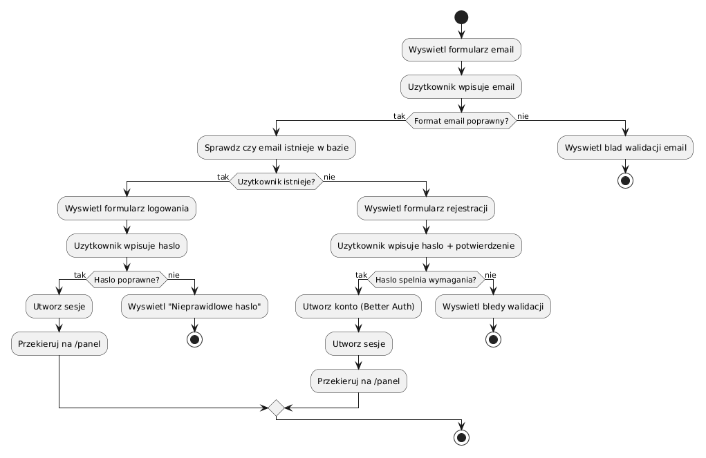

**Opis:** Diagram przedstawiający przepływ procesu autentykacji od wpisania emaila przez użytkownika do przekierowania na panel organizatora.

_Przepływ:_

\newpage

## 11. Diagramy stanów

### Lista diagramów stanów

| ID     | Diagram                       | Opis                                             |
| ------ | ----------------------------- | ------------------------------------------------ |
| DST-01 | Stany wiadomości              | Cykl życia wiadomości od utworzenia do usunięcia |
| DST-02 | Stany połączenia WebSocket    | Connected, Disconnected, Reconnecting            |
| DST-03 | Stany formularza autentykacji | EMAIL → ENTER_PASSWORD / CREATE_PASSWORD         |

### Diagram stanów: Stany wiadomości (DST-01) [BK]

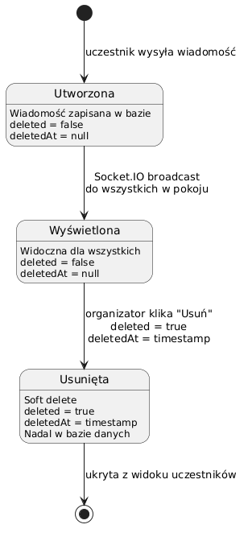

**Opis:** Diagram stanów UML przedstawiający cykl życia obiektu Message w systemie.

**Opis stanów:**

| Stan                   | Pole `deleted` | Pole `deletedAt` | Widoczność                                 |
| ---------------------- | -------------- | ---------------- | ------------------------------------------ |
| Utworzona              | `false`        | `null`           | Widoczna w bazie, jeszcze nie rozesłana    |
| Wyświetlona            | `false`        | `null`           | Widoczna dla wszystkich uczestników pokoju |
| Usunięta (soft delete) | `true`         | `<timestamp>`    | Ukryta z widoku, nadal w bazie danych      |

## 12. Dokumentacja bezpieczeństwa

### Bezpieczeństwo danych podczas składowania

| Mechanizm | Opis |
|-----------|------|
| **Hashowanie haseł** | Better Auth automatycznie hashuje hasła algorytmem bcrypt przed zapisem do bazy danych. Hasła nigdy nie są przechowywane w postaci jawnej. |
| **Szyfrowanie bazy danych** | Neon PostgreSQL wymusza połączenia SSL/TLS. Dane przechowywane są na zaszyfrowanych dyskach. |
| **Walidacja siły hasła** | Hasło musi zawierać min. 8 znaków, wielką literę, małą literę, cyfrę i znak specjalny. Walidacja po stronie klienta (Zod) i serwera. |
| **Soft delete** | Wiadomości nie są fizycznie usuwane z bazy - ustawiana jest flaga `deleted = true` i `deletedAt = timestamp`. Umożliwia to ewentualny audyt. |

### Bezpieczeństwo danych podczas przesyłania

| Mechanizm | Opis |
|-----------|------|
| **HTTPS** | Render wymusza HTTPS na wszystkich połączeniach. Certyfikat SSL/TLS generowany automatycznie. |
| **WSS (WebSocket Secure)** | Socket.IO komunikuje się przez WSS (WebSocket over TLS) w środowisku produkcyjnym. |
| **CORS** | Origin ograniczony do `NEXT_PUBLIC_SITE_URL` - tylko nasza domena może komunikować się z API. |
| **Walidacja danych wejściowych** | Wszystkie dane walidowane schematami Zod po stronie klienta i serwera (tRPC). |
| **Ograniczenie rozmiaru pakietu** | Socket.IO `maxHttpBufferSize` ustawiony na 1 KB- ochrona przed przesyłaniem dużych payloadów. |

### Bezpieczeństwo w projekcie

| Zasada | Implementacja |
|--------|---------------|
| **Secure by Design** | Security headers (HSTS, X-Frame-Options, X-Content-Type-Options, Referrer-Policy, Permissions-Policy) skonfigurowane w `next.config.js`. Rate limiting na Socket.IO (max 30 wiadomości/min). Walidacja wejścia na każdym endpointcie. |
| **Privacy by Design** | Uczestnicy są anonimowi - nie wymagana rejestracja. System nie zbiera danych osobowych uczestników. Minimalizacja danych: przechowywane tylko treść wiadomości i identyfikator socketa. |
| **Defence in Depth** | Walidacja na wielu warstwach: formularz (React Hook Form + Zod), API (tRPC + Zod), baza danych (constrainty PostgreSQL). Middleware Next.js chroni trasy `/panel` przed nieautoryzowanym dostępem. |

### Nagłówki bezpieczeństwa HTTP

| Nagłówek | Wartość | Cel |
|----------|---------|-----|
| `X-Frame-Options` | `DENY` | Ochrona przed clickjackingiem |
| `X-Content-Type-Options` | `nosniff` | Zapobieganie MIME sniffingowi |
| `Referrer-Policy` | `strict-origin-when-cross-origin` | Kontrola nagłówka Referer |
| `Permissions-Policy` | `camera=(), microphone=(), geolocation=()` | Blokada dostępu do kamery, mikrofonu, geolokalizacji |
| `X-XSS-Protection` | `1; mode=block` | Ochrona przed XSS (starsze przeglądarki) |
| `Strict-Transport-Security` | `max-age=63072000; includeSubDomains; preload` | Wymuszenie HTTPS |

\newpage

## 13. Dostępność (WCAG)

### Deklaracja zgodności

Aplikacja Live Feedback Wall została zaprojektowana z uwzględnieniem wytycznych WCAG 2.1 na poziomie AA. Poniżej przedstawiono zastosowane rozwiązania zwiększające dostępność.

### Zastosowane rozwiązania

| Obszar | Rozwiązanie | Lokalizacja |
|--------|-------------|-------------|
| **Język dokumentu** | `lang="pl"` na elemencie `<html>` | `src/app/layout.tsx` |
| **Skip navigation** | Link "Przejdź do treści" widoczny przy fokusie (Tab), prowadzący do `#main-content` | `src/app/layout.tsx` |
| **Semantyczny HTML** | `<main>`, `<nav>`, `<header>`, `<footer>`, `<section>` z `aria-labelledby` | Strona główna, panel, layout |
| **Nawigacja klawiaturą** | Wszystkie interaktywne elementy dostępne przez Tab. Focus-visible na przyciskach i inputach. | Komponenty UI (shadcn/ui + Radix) |
| **Przyciski icon-only** | `aria-label` na przyciskach zawierających tylko ikonę (wyloguj, wyślij, zamknij, motyw) | `header.tsx`, `Room.tsx`, `Panel.tsx` |
| **Ikony dekoracyjne** | `aria-hidden="true"` na ikonach Lucide, które nie niosą treści | Wszystkie ikony dekoracyjne |
| **Czat real-time** | `role="log"` i `aria-live="polite"` na kontenerze wiadomości - czytnik ekranu ogłasza nowe wiadomości | `Chat.tsx` |
| **Status połączenia** | `aria-live="polite"` na wskaźniku połączenia WebSocket | `Room.tsx` |
| **Formularze** | `<label>` z `htmlFor` powiązane z inputami. Komunikaty błędów pod polami. | Formularze auth, wiadomości |
| **Kod pokoju (OTP)** | Każde pole OTP ma `aria-label="Znak X kodu pokoju"` | `RoomJoin.tsx` |
| **Motyw ciemny/jasny** | Dynamiczny `aria-label` na przycisku toggle ("Przełącz na tryb jasny/ciemny") | `ThemeToggle.tsx` |
| **Kontrast kolorów** | Tryb ciemny i jasny z kolorami spełniającymi wymagania kontrastu WCAG AA | Tailwind CSS, zmienne CSS |
| **Responsywność** | Interfejs dostosowany do urządzeń mobilnych i desktopowych (mobile-first) | Tailwind CSS breakpoints |

### Uwzględnienie dysfunkcji

| Dysfunkcja | Rozwiązanie |
|------------|-------------|
| **Wzrok** | Tryb ciemny/jasny, semantyczny HTML, aria-label na elementach interaktywnych, skip navigation, responsywne rozmiary czcionek |
| **Słuch** | Aplikacja jest w pełni tekstowa - nie używa dźwięków ani powiadomień audio. Brak barier dla osób niesłyszących. |
| **Koordynacja ruchowa** | Pełna nawigacja klawiaturą (Tab, Enter, Escape). Duże obszary klikalne na przyciskach. Focus-visible na interaktywnych elementach. |

\newpage

## 14. Diagram klas

### Lista klas / modułów

| Klasa / Moduł | Typ | Opis |
|----------------|-----|------|
| `Room` | Encja DB | Pokój feedback wall (id, name, roomCode, userId) |
| `Message` | Encja DB | Wiadomość w pokoju (id, content, sender, roomId, deleted) |
| `User` | Encja DB | Użytkownik-organizator (id, email, name) |
| `Session` | Encja DB | Sesja autentykacji (id, token, userId, expiresAt) |
| `Account` | Encja DB | Konto uwierzytelniania (id, providerId, password) |
| `AuthStore` | Zustand Store | Stan formularza autentykacji (step, email) |
| `useSocketRoom` | Hook | Zarządzanie połączeniem WebSocket z pokojem |
| `useInfiniteScroll` | Hook | Infinite scroll z IntersectionObserver |
| `roomRouter` | tRPC Router | Endpointy CRUD dla pokoi |
| `messageRouter` | tRPC Router | Endpointy CRUD dla wiadomości |

### Diagram klas: Encje bazodanowe [BK]

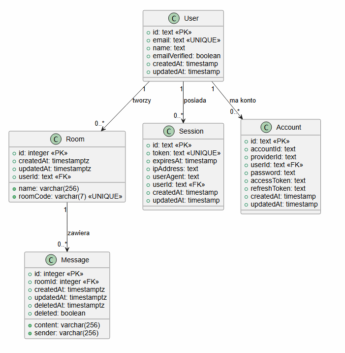

**Opis:** Diagram klas UML przedstawiający encje bazodanowe (Room, Message, User, Session, Account) z atrybutami, typami i relacjami.


\newpage

## 15. Kod SQL

### a) Standard SQL (ANSI)

Pełny kod SQL w standardzie ANSI znajduje się w repozytorium: [`sql/standard.sql`](../sql/standard.sql)

Przykład - tabela pokoi:

```sql
CREATE TABLE "room" (
    id              INTEGER         PRIMARY KEY GENERATED BY DEFAULT AS IDENTITY,
    name            VARCHAR(256)    NOT NULL,
    room_code       VARCHAR(7)      NOT NULL UNIQUE,
    created_at      TIMESTAMP       NOT NULL DEFAULT CURRENT_TIMESTAMP,
    updated_at      TIMESTAMP,
    user_id         VARCHAR(255)    NOT NULL,
    FOREIGN KEY (user_id) REFERENCES "user"(id) ON DELETE CASCADE
);
```

### b) Dialekt PostgreSQL

Pełny kod SQL w dialekcie PostgreSQL znajduje się w repozytorium: [`sql/postgresql.sql`](../sql/postgresql.sql)

Przykład - tabela pokoi:

```sql
CREATE TABLE "room" (
    id          INTEGER PRIMARY KEY GENERATED BY DEFAULT AS IDENTITY
                (INCREMENT BY 1 MINVALUE 1 MAXVALUE 2147483647 START WITH 1 CACHE 1),
    name        VARCHAR(256)                NOT NULL,
    "roomCode"  VARCHAR(7)                  NOT NULL UNIQUE,
    "createdAt" TIMESTAMP WITH TIME ZONE    NOT NULL DEFAULT CURRENT_TIMESTAMP,
    "updatedAt" TIMESTAMP WITH TIME ZONE,
    "userId"    TEXT                        NOT NULL,
    CONSTRAINT room_user_id_fk
        FOREIGN KEY ("userId") REFERENCES "user"(id) ON DELETE CASCADE
);
```

### Różnice między standardem a dialektem

| Element | Standard SQL (ANSI) | Dialekt PostgreSQL |
|---------|--------------------|--------------------|
| Typ tekstowy | `VARCHAR(255)` | `TEXT` (bez limitu) |
| Timestamp | `TIMESTAMP` | `TIMESTAMP WITH TIME ZONE` |
| Domyślna wartość czasu | `DEFAULT CURRENT_TIMESTAMP` | `DEFAULT now()` |
| Nazwy kolumn | `snake_case` | `"camelCase"` (w cudzysłowach) |
| Indeksy | Brak | Dodatkowe indeksy na FK i kolumnach wyszukiwania |

\newpage

## 16. Przypadki testowe

### Przypadek testowy 1: Walidacja formularza rejestracji [BK]

| Element | Opis |
|---------|------|
| **ID** | PT-01 |
| **Nazwa** | Walidacja silnego hasła przy rejestracji |
| **Cel** | Sprawdzenie czy schemat `createPasswordSchema` poprawnie waliduje wymagania dotyczące siły hasła |
| **Warunki wstępne** | Brak |

| # | Dane wejściowe | Oczekiwany wynik | Rzeczywisty wynik |
|---|----------------|------------------|-------------------|
| 1 | email: `user@test.pl`, password: `MojeHaslo123!`, confirmPassword: `MojeHaslo123!` | Walidacja przechodzi (success = true) | Zgodny z oczekiwanym |
| 2 | email: `user@test.pl`, password: `mojehaslo123!`, confirmPassword: `mojehaslo123!` | Błąd: "Hasło musi zawierać co najmniej jedną wielką literę" | Zgodny z oczekiwanym |
| 3 | email: `user@test.pl`, password: `MojeHaslo123`, confirmPassword: `MojeHaslo123` | Błąd: "Hasło musi zawierać co najmniej jeden znak specjalny" | Zgodny z oczekiwanym |
| 4 | email: `user@test.pl`, password: `MojeHaslo123!`, confirmPassword: `InneHaslo456!` | Błąd: "Hasła nie są takie same" | Zgodny z oczekiwanym |

### Przypadek testowy 2: Generowanie kodu pokoju [BK]

| Element | Opis |
|---------|------|
| **ID** | PT-02 |
| **Nazwa** | Generowanie unikalnego kodu pokoju w formacie XXX-XXX |
| **Cel** | Sprawdzenie czy funkcja `generateRoomCode` generuje kody w poprawnym formacie i unikalne |
| **Warunki wstępne** | Brak |

| # | Dane wejściowe | Oczekiwany wynik | Rzeczywisty wynik |
|---|----------------|------------------|-------------------|
| 1 | Wywołanie `generateRoomCode()` | Kod pasuje do wzorca `/^[A-Za-z0-9]{3}-[A-Za-z0-9]{3}$/` | Zgodny z oczekiwanym |
| 2 | Wywołanie `generateRoomCode()` | Kod ma dokładnie 7 znaków (3 + myślnik + 3) | Zgodny z oczekiwanym |
| 3 | 50 wywołań `generateRoomCode()` | Wszystkie 50 kodów jest unikalnych | Zgodny z oczekiwanym |
| 4 | Wywołanie `generateRoomCode()` | Kod zawiera wyłącznie znaki alfanumeryczne i myślnik | Zgodny z oczekiwanym |

\newpage

## 17. Testy jednostkowe

Projekt wykorzystuje framework **Vitest** do testów jednostkowych. Testy znajdują się w katalogu `src/__tests__/`.

### Test 1: Walidacja schematu rejestracji (`createPasswordSchema`) [BK]

**Plik:** `src/__tests__/validation.test.ts`

```typescript
describe("createPasswordSchema", () => {
  it("powinien zaakceptować formularz z pasującymi, silnymi hasłami", () => {
    const result = createPasswordSchema.safeParse({
      email: "user@test.pl",
      password: "MojeHaslo123!",
      confirmPassword: "MojeHaslo123!",
    });
    expect(result.success).toBe(true);
  });

  it("powinien odrzucić hasło bez znaku specjalnego", () => {
    const result = createPasswordSchema.safeParse({
      email: "user@test.pl",
      password: "MojeHaslo123",
      confirmPassword: "MojeHaslo123",
    });
    expect(result.success).toBe(false);
    if (!result.success) {
      const error = result.error.issues.find((i) =>
        i.message.includes("znak specjalny"),
      );
      expect(error).toBeDefined();
    }
  });
});
```

### Test 2: Generowanie kodu pokoju (`generateRoomCode`) [BK]

**Plik:** `src/__tests__/roomCode.test.ts`

```typescript
describe("generateRoomCode", () => {
  it("powinien wygenerować kod w formacie XXX-XXX", () => {
    const code = generateRoomCode();
    expect(code).toMatch(/^[A-Za-z0-9]{3}-[A-Za-z0-9]{3}$/);
  });

  it("powinien generować unikalne kody przy kolejnych wywołaniach", () => {
    const codes = new Set<string>();
    for (let i = 0; i < 50; i++) {
      codes.add(generateRoomCode());
    }
    expect(codes.size).toBe(50);
  });
});
```

### Wynik uruchomienia testów

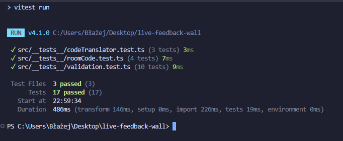

**Opis screenshota:** Zrzut ekranu z terminala/IDE po wykonaniu komendy `npm test`. Widoczne: 3 pliki testowe (PASS), 17 testów passed, 0 failed. Nazwy testów w języku polskim.

## 18. Diagram komponentów i wdrożenia

### Diagram wdrożenia

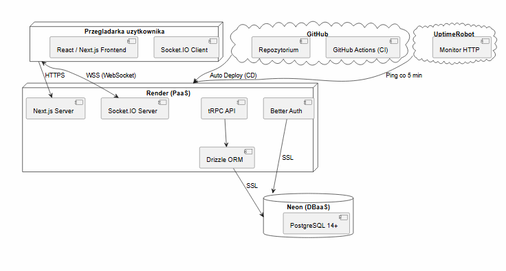

**Opis:** Diagram UML przedstawiający fizyczne rozmieszczenie komponentów systemu na infrastrukturze.

\newpage

## 19. Instalacja i konfiguracja (CI/CD)

### Instalacja lokalna

#### Wymagania

- Node.js >= 20
- PostgreSQL 14+ (lub Docker)
- npm

#### Kroki

```bash
# 1. Klonowanie repozytorium
git clone https://github.com/bsk03/live-feedback-wall.git
cd live-feedback-wall

# 2. Instalacja zależności
npm install

# 3. Konfiguracja zmiennych środowiskowych
cp .env.example .env
# Uzupełnij wartości w pliku .env

# 4. Uruchomienie bazy danych (Docker)
docker compose up -d

# 5. Migracja bazy danych
npx drizzle-kit push

# 6. Uruchomienie serwera deweloperskiego
npm run dev
```

Aplikacja dostępna pod `http://localhost:3000`.

### Zmienne środowiskowe

| Zmienna | Opis | Wymagana |
|---------|------|----------|
| `DATABASE_URL` | Connection string PostgreSQL | Tak |
| `BETTER_AUTH_SECRET` | Sekret do podpisywania sesji | Tak |
| `BETTER_AUTH_URL` | URL aplikacji | Tak |
| `NEXT_PUBLIC_SITE_URL` | Publiczny URL aplikacji | Tak |
| `NODE_ENV` | Środowisko (`development` / `production`) | Nie (domyślnie: `development`) |

### CI - GitHub Actions

Pipeline CI uruchamiany automatycznie przy każdym push/PR na branch `main`.

**Plik:** `.github/workflows/ci.yml`

| Job | Komenda | Opis |
|-----|---------|------|
| **Lint** | `npm run lint` | Sprawdzenie ESLint |
| **Type Check** | `npm run typecheck` | Sprawdzenie typów TypeScript (`tsc --noEmit`) |
| **Test** | `npm test` | Uruchomienie testów jednostkowych (Vitest, 17 testów) |

Joby lint, typecheck i test uruchamiają się **równolegle**.

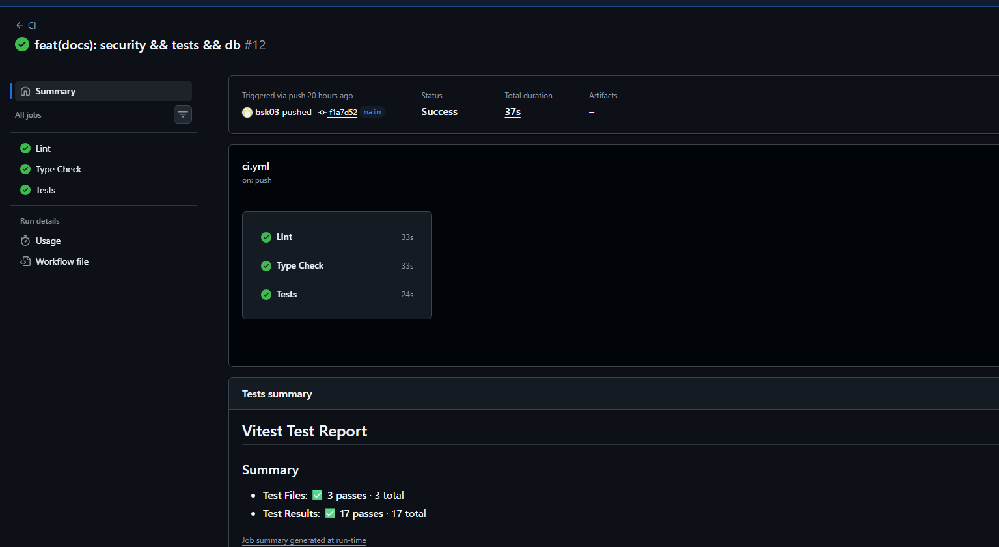

**Opis screenshota:** Zrzut ekranu z zakładki Actions w repozytorium GitHub. Widoczne: zielone checkmarki przy jobach Lint, Type Check, Test. Nazwa workflow: "CI".

### CD - Render

Render automatycznie wykrywa push na branch `main` i uruchamia deployment.

| Krok | Komenda | Opis |
|------|---------|------|
| Install | `npm install --include=dev` | Instalacja zależności (w tym devDependencies potrzebnych do buildu) |
| Build | `npm run build` | Build Next.js + migracja bazy (`drizzle-kit push`) |
| Start | `node server.js` | Uruchomienie custom servera (Next.js + Socket.IO) |

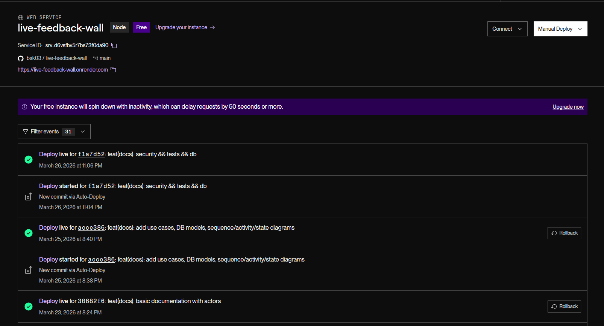

**Opis screenshota:** Zrzut ekranu z Render Dashboard → zakładka Deploys. Widoczne: zielony status "Live", data ostatniego deployu, czas buildu.

### Monitoring - UptimeRobot

UptimeRobot pinguje aplikację co 5 minut, zapobiegając uśpieniu instancji Render Free Tier.

\newpage

## 20. Implementacja mechanizmów bezpieczeństwa w praktyce

### 1. Security Headers (`next.config.js`)

```javascript
async headers() {
  return [
    {
      source: "/(.*)",
      headers: [
        { key: "X-Frame-Options", value: "DENY" },
        { key: "X-Content-Type-Options", value: "nosniff" },
        { key: "Referrer-Policy", value: "strict-origin-when-cross-origin" },
        { key: "Permissions-Policy", value: "camera=(), microphone=(), geolocation=()" },
        { key: "X-XSS-Protection", value: "1; mode=block" },
        { key: "Strict-Transport-Security",
          value: "max-age=63072000; includeSubDomains; preload" },
      ],
    },
  ];
},
```

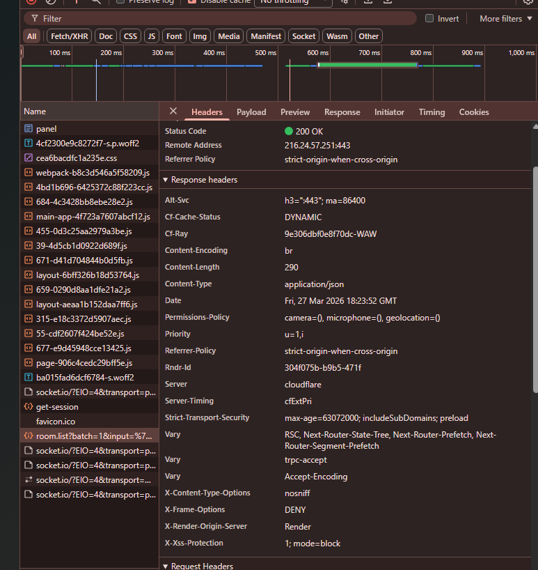

**Opis screenshota:** Zrzut ekranu z Chrome DevTools → zakładka Network → klik na request → Response Headers. Widoczne nagłówki: X-Frame-Options, X-Content-Type-Options, Strict-Transport-Security itp.

### 2. Rate Limiting na Socket.IO (`server.js`)

```javascript
const MESSAGE_LIMIT = 30;
const MESSAGE_WINDOW_MS = 60_000;
const messageCounts = new Map();

/** @param {string} socketId */
function isRateLimited(socketId) {
  const now = Date.now();
  const entry = messageCounts.get(socketId);
  if (!entry || now - entry.windowStart > MESSAGE_WINDOW_MS) {
    messageCounts.set(socketId, { windowStart: now, count: 1 });
    return false;
  }
  entry.count++;
  if (entry.count > MESSAGE_LIMIT) {
    return true;
  }
  return false;
}
```

### 3. CORS ograniczony do domeny (`server.js`)

```javascript
const io = new Server(httpServer, {
  cors: {
    origin: siteUrl,  // tylko nasza domena, nie "*"
    methods: ["GET", "POST"],
    credentials: true,
  },
  maxHttpBufferSize: 1024,  // max 1 KB per pakiet
});
```

### 4. Walidacja danych wejściowych (Zod + tRPC)

```typescript
// Walidacja po stronie serwera - router tRPC
sendMessage: publicProcedure
  .input(
    z.object({
      roomId: z.number(),
      content: z.string().min(1, "Wiadomość nie może być pusta"),
    }),
  )
  .mutation(async ({ ctx, input }) => {
    await ctx.db.insert(messages).values({
      roomId: input.roomId,
      content: input.content,
      sender: "anonymous",
    });
  }),
```

### 5. Walidacja Socket.IO (`server.js`)

```javascript
socket.on("message", (data) => {
  // Walidacja formatu
  if (!data || typeof data.roomId !== "string" || typeof data.message !== "object") {
    socket.emit("error", { message: "Nieprawidłowy format wiadomości" });
    return;
  }
  // Rate limiting
  if (isRateLimited(socket.id)) {
    socket.emit("error", { message: "Zbyt wiele wiadomości. Spróbuj ponownie za chwilę." });
    return;
  }
  // Sprawdzenie członkostwa w pokoju
  if (!socket.rooms.has(data.roomId)) {
    socket.emit("error", { message: "Nie jesteś w tym pokoju" });
    return;
  }
  io.to(data.roomId).emit("message", { message: data.message });
});
```

### 6. Middleware autoryzacji (Next.js + tRPC)

```typescript
// Middleware Next.js - ochrona tras
export async function middleware(request: NextRequest) {
  const sessionToken = request.cookies.get("better-auth.session_token");
  if (!sessionToken && pathname === "/panel") {
    return NextResponse.redirect(new URL("/auth", request.url));
  }
}

// tRPC - protectedProcedure
const authMiddleware = t.middleware(async ({ next, ctx }) => {
  const session = await getServerSession();
  if (!session) {
    throw new TRPCError({ code: "UNAUTHORIZED" });
  }
  return next({ ctx: { ...ctx, session } });
});
```

# Dokumentacja użytkownika (sekcja 22)

\newpage

## 21. Podręcznik użytkownika

### Spis treści podręcznika

1. [Rejestracja konta organizatora](#2-rejestracja-konta-organizatora)
2. [Dołączanie do pokoju jako uczestnik](#7-dołączanie-do-pokoju-jako-uczestnik)


---
### 0. Wprowadzenie

Live Feedback Wall to aplikacja webowa umożliwiająca zbieranie opinii od uczestników wydarzeń w czasie rzeczywistym. Aplikacja obsługuje dwa typy użytkowników:

- **Organizator** - tworzy pokoje, udostępnia kody dostępu, przegląda i moderuje wiadomości. Wymaga rejestracji.
- **Uczestnik** - dołącza do pokoju przez kod, wysyła wiadomości. Nie wymaga rejestracji.

Aplikacja działa w przeglądarce internetowej na komputerach, tabletach i smartfonach.

---

### 1. Rejestracja konta organizatora [BK]

Rejestracja jest wymagana tylko dla organizatorów. Uczestnicy nie muszą zakładać konta.

**Krok 1.** Otwórz stronę główną aplikacji i kliknij przycisk **"Jestem organizatorem"**.

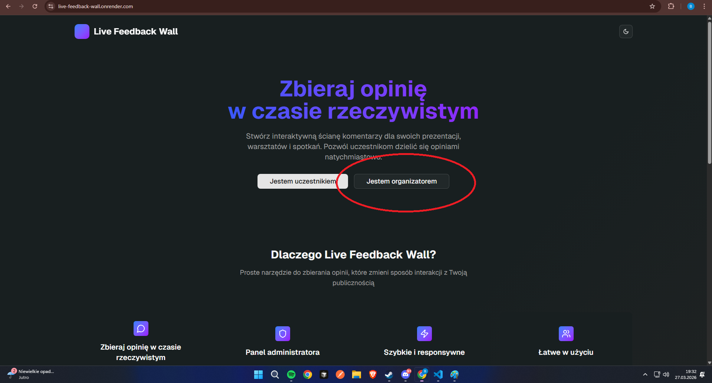

**Krok 2.** Wpisz swój adres email w formularzu i kliknij **"Dalej"**.

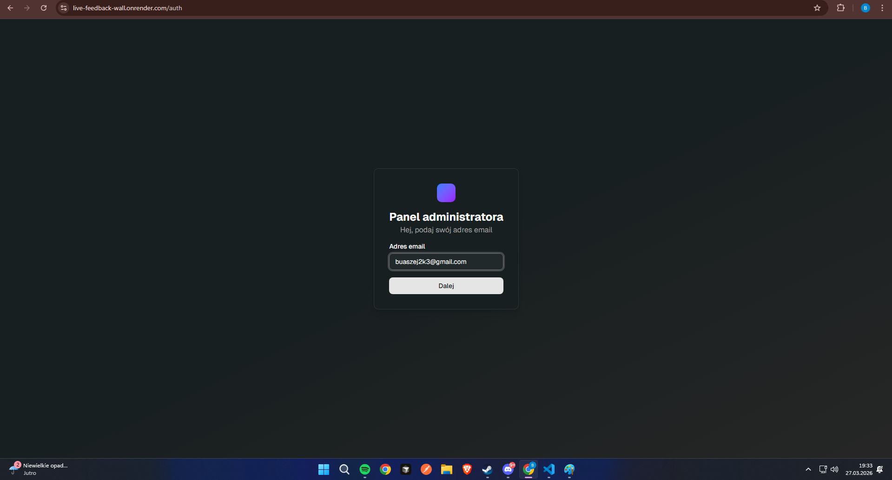

**Krok 3.** Jeśli konto z tym adresem nie istnieje, system wyświetli formularz rejestracji. Wpisz hasło spełniające wymagania:
- Minimum 8 znaków
- Co najmniej jedna wielka litera
- Co najmniej jedna mała litera
- Co najmniej jedna cyfra
- Co najmniej jeden znak specjalny (np. `!@#$%`)

Wpisz hasło ponownie w polu "Potwierdź hasło" i kliknij **"Dalej"**.

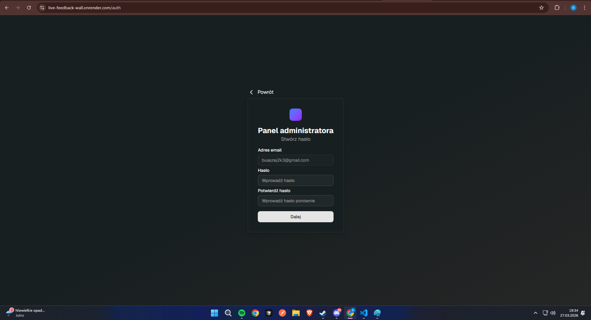

**Krok 4.** Po pomyślnej rejestracji zostaniesz automatycznie przekierowany do panelu organizatora.

---

### 7. Dołączanie do pokoju jako uczestnik [BK]

Uczestnik nie musi zakładać konta. Wystarczy kod pokoju.

**Krok 1.** Otwórz stronę główną aplikacji i kliknij **"Jestem uczestnikiem"** lub otwórz bezpośredni link otrzymany od organizatora.

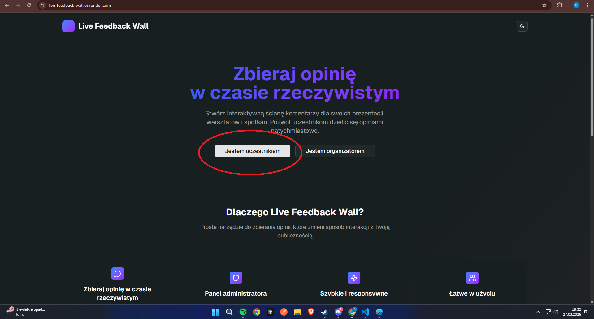

**Krok 2.** Wpisz 6-znakowy kod pokoju w pola formularza (3 znaki, myślnik, 3 znaki).

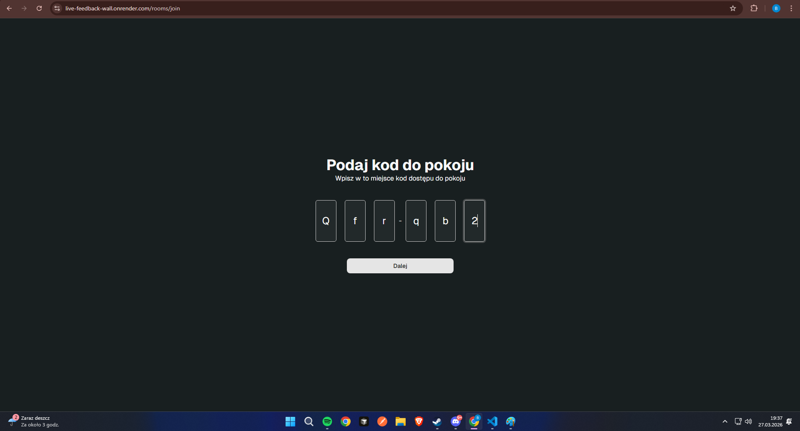

**Krok 3.** Kliknij **"Dalej"**. System zweryfikuje kod i przekieruje Cię do pokoju.

> Jeśli kod jest nieprawidłowy lub pokój nie istnieje, wyświetli się komunikat "Błąd podczas dołączania do pokoju".

**Krok 4.** Po dołączeniu zobaczysz widok pokoju z historią wiadomości i polem do pisania.

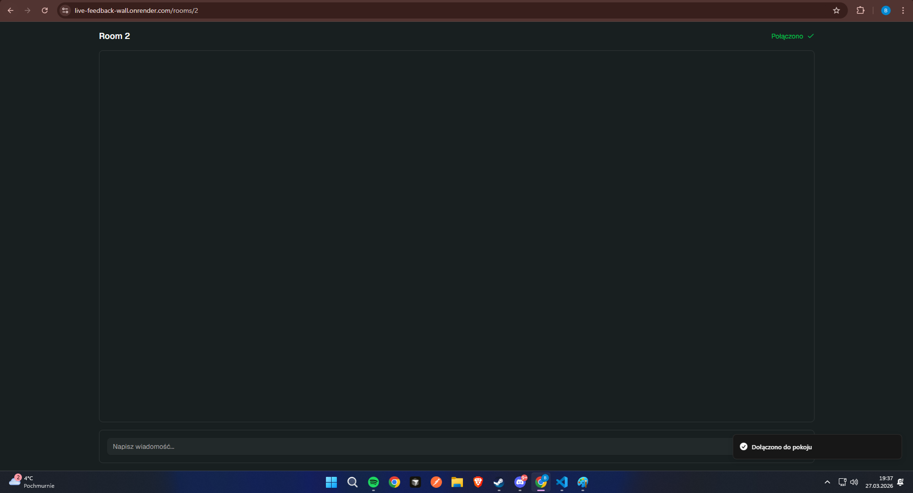


